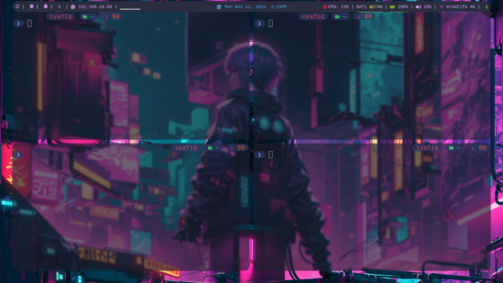

# 🚀 My i3wm Dotfiles

Ini adalah dotfiles untuk **i3wm** (i3 Window Manager) yang sudah dikustomisasi sesuai kebutuhan dan preferensi pribadi. Konfigurasi ini dirancang untuk memberikan pengalaman yang efisien, minimalis, dan estetis untuk workflow sehari-hari.

## 📸 Screenshots

**Desktop Preview:**




---

## ✨ Fitur Utama

- **Tampilan Minimalis:** Fokus pada kesederhanaan dan produktivitas tanpa mengorbankan estetika.
- **Navigasi Keyboard Cepat:** Memanfaatkan keybindings yang efisien untuk navigasi antar jendela.
- **Status Bar yang Informatif:** Menggunakan `i3status` atau `polybar` (jika diaktifkan) untuk menampilkan informasi seperti baterai, jaringan, volume, dll.
- **Dukungan Multimonitor:** Konfigurasi otomatis untuk setup multi-monitor.
- **Autostart Aplikasi:** Beberapa aplikasi seperti `picom`, `nm-applet`, dan lainnya dimulai secara otomatis.

## 📂 Struktur Repositori

```
├── cava -> /home/user/.config/cava
├── i3 -> /home/user/.config/i3
├── kitty -> /home/user/.config/kitty
├── picom -> /home/user/.config/picom
├── polybar -> /home/user/.config/polybar
├── README.md
└── rofi -> /home/user/.config/rofi
```
## 📦 Prasyarat

Pastikan kamu sudah menginstal beberapa dependensi berikut sebelum menggunakan dotfiles ini:

- **i3wm**
- **polybar**
- **picom**
- **rofi**
- **nitrogen**
- **nm-applet**

Untuk menginstalnya di sistem berbasis Debian/Ubuntu:

```bash
sudo apt update
sudo apt install i3 cava picom rofi nitrogen nm-applet
```

## 🚀 Cara Menggunakan

1. **Clone** repositori ini ke direktori home:

   ```bash
   git clone https://github.com/syafiqparadisam/i3-dotfiles.git ~/i3-dotfiles

   ```

2. **Backup** konfigurasi i3 yang lama (jika ada):

	```bash
	mv ~/.config/i3 ~/.config/i3.backup
	mv ~/.config/polybar ~/.config/polybar.backup
	```

3. **Copy config** 
	```bash
	cp -r ~/i3-dotfiles/config/* ~/.config/
	```

4. **Restart** i3 dengan Mod + Shift + R untuk menerapkan perubahan.

## 🛠 Troubleshooting

- **Periksa** apakah semua dependensi sudah terinstal dengan benar.
- Gunakan perintah berikut untuk **merestart** i3 jika terjadi masalah:
  ```bash
  i3-msg restart

## Jika masalah berlanjut
logout atau login kembali untuk menerapkan perubahan.
Cek log i3 untuk mengetahui detail error:
	```
	journalctl -xe
	```

## 💡 Inspirasi & Terima Kasih
<a href="https://i3wm.org/">i3wm Documentation</a>

<a href="https://www.reddit.com/r/unixporn/">r/unixporn</a>

#### Nikmati pengalaman menggunakan i3wm yang lebih cepat, efisien, dan keren! 🚀


